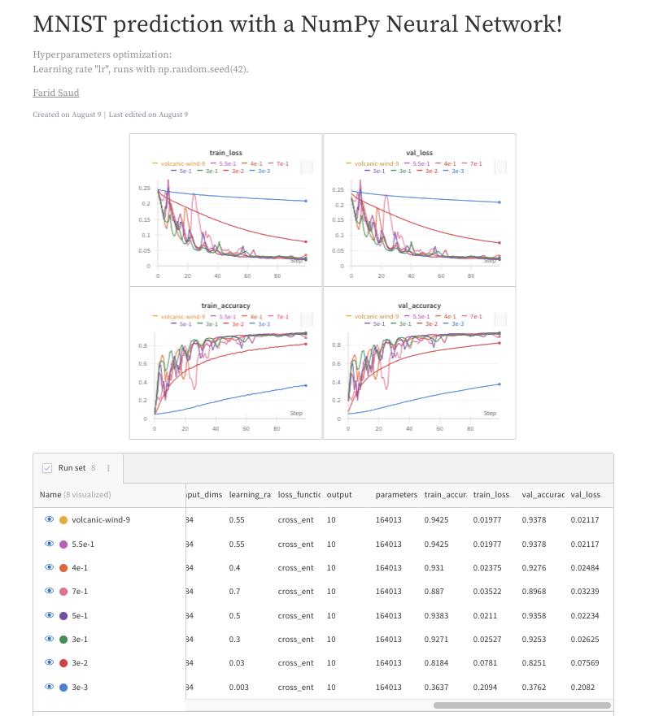

# A Neural Network using NumPy for MNIST
& Fashion MNIST 

## Overview

This project is an implementation of a fully-connected neural network using **NumPy** only, without relying on deep learning frameworks like PyTorch or TensorFlow. The network is trained on the MNIST dataset (accessible via Google Colab), and it classifies handwritten digits into one of ten categories (0-9). A similar implementation for Fashion MNIST is also included in a seperate notebook.

## Key Features

- **Fully Connected Neural Network**: The network consists of 4 layers: an input layer, 2 hidden layers, and an output layer. This network has 164,013 parameters.
- **Custom Activation and Helper Functions**: Efficiently implemented functions such as ReLU, Softmax, One-hot Encoding, Cross-entropy loss, and ReLU derivative (ReLU prime).
- **Custom Training Loop**: The training loop is implemented from scratch, offering detailed insights into *vectorized* forward and backward propagation, and gradient descent optimization.
- **Visualization**: Includes functionality to visualize predictions and a confusion matrix for evaluating model performance.
- **Weights & Biases Integration**: Integrated with [Weights & Biases](https://wandb.ai/) for tracking experiments, logging metrics, and visualizing the training process.

## Project Structure

- `Neural_Network_in_NP.ipynb`: The Jupyter Notebook where the entire neural network is implemented, available in Google Colab.
- `data/`: The MNIST dataset is accessible in Google Colab under `/content/sample_data/mnist_train_small.csv` and `/content/sample_data/mnist_test.csv`. A cell to load the full version of the dataset from `sklearn.datasets` is also included for convenience.

## Results

With an optimized learning rate of `5.5e-2`, the model achieved a **94% validation accuracy**. Below are the results:

### Confusion Matrix:

### Example Predictions:

### Hyperparameter Optimization

The hyperparameter optimization was logged using Weights & Biases. Click the image below to view the detailed report.

## Requirements

### Core Dependencies
- **NumPy**: Used for matrix operations and core numerical computations.
- **Pandas**: Used exclusively for loading and preprocessing the MNIST dataset.

**Note**
For 2-D arrays, np.dot performs matrix multiplication. To be more readable and explicit:
- **np.matmul()** is used for matrix multiplication
- "*" is used for element-wise multiplication

